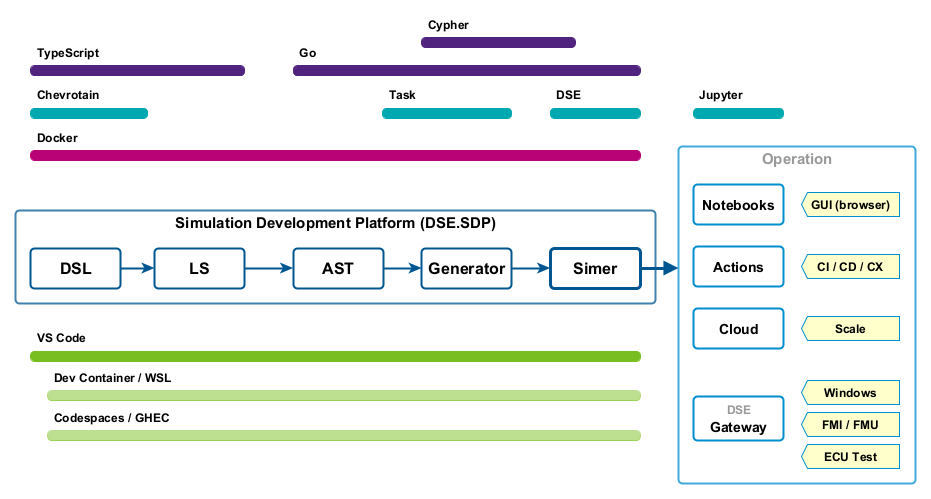

# Dynamic Simulation Environment - Simulation Development Platform

[](https://github.com/boschglobal/dse.sdp/actions/workflows/containers.yaml)
[](https://github.com/boschglobal/dse.sdp/actions/workflows/super-linter.yaml)
[](https://codespaces.new/boschglobal/dse.sdp?quickstart=1)


## Introduction

Simulation Development Platform for the Dynamic Simulation Environment (DSE) Core Platform.




### Project Structure

```text
.devcontainer/  <-- devcontainer definition
ast             <-- AST tools
doc             <-- documentation
└── html2img/   <-- containerized tool to convert html to image
dsl             <-- DSL parser (using Chevrotain)
examples
└── graph       <-- graph examples (for Report tool)
└── openloop    <-- Open Loop simulation using FMU based Linear Equation model
└── notebook    <-- Jupyter base simulation example
└── vscode      <-- VS Code integration examples
graph
graph
└── build/package
    └── report/     <-- Report tool
licenses            <-- Third Party Licenses
lsp                 <-- VS Code Language Server
tests
└── testscript
    └── e2e/        <-- repo level end-to-end tests
Makefile            <-- repo level Makefile
```


## Usage

> Hint: Codespaces is known to work with Chrome and Edge browsers. Firefox may prevention operation via Firefox's Setting "Enhanced Tracking Protection" (try setting to Standard to resolve the issue).


### Examples

* [VS Code Integration Example](examples/vscode/README.md)
* [Notebook Based Simulation Example](examples/notebook/README.md)
* [Open Loop Simulation Example](examples/openloop/README.md)


### Running ModelC Example Simulations

Start a Codespace, then type the following commands in the terminal window.

```bash
# Check your environment.
$ dse-env
DSE_MODELC_VERSION=2.1.30
DSE_REPORT_IMAGE=ghcr.io/boschglobal/dse-report:latest
DSE_SIMER_IMAGE=ghcr.io/boschglobal/dse-simer:latest

# Setup the examples (will download ModelC examples).
$ make examples
$ ls out/examples/modelc/
benchmark/  binary/  extended/  gateway/  gdb/  minimal/  ncodec/  runtime/  simer/  transform/

# Validate a simulation using the Report tool.
$ dse-report out/examples/modelc/minimal
...
=== Summary ===================================================================
[PASS] Duplicate Writes Check
[PASS] ModelInstance Name Check
[PASS] Model UID Check
[PASS] Channel 'expectedModelCount'
[PASS] Count 'ModelInst' in AST and SIM
Ran 5 Reports | Passed: 5 | Failed: 0

# Run a simulation using Simer.
$ dse-simer out/examples/modelc/minimal
...
2) Run the Simulation ...
2) Controller exit ...


# Build and run a simulation using the DSL.
$ cd examples/vscode
$ make build
...
$ make report
...
$ make run
...
```

> Hint: Find more information about the Simer [command options here](https://boschglobal.github.io/dse.doc/docs/user/simer/#options).

> Hint: Find more information about the Report [command options here](https://boschglobal.github.io/dse.doc/docs/user/report/#options).


### Connect a Remote Gateway Model to a Simulation running in Cloudspace

A Cloudspace can forward ports to allow remote connections to services running in that Cloudspace.
In particular these scenarios exist:

1. Cloudspace running in a Web Browser: ports are forwarded via HTTP endpoints (i.e. URLs). This is not suitable for Simer based simulations as there is no support for HTTP endpoints (at this time).
2. Cloudspace running in VS Code: ports are forwarded to local host. Local applications can connect to these ports and access services running in the Cloudspace. This **is** suitable for Simer based simulations.

#### Connect VS Code to a Cloudspace

> Hint: Start the Codespace in a Web Browser first, then connect to the running Codespace from VS Code.

1. Start VS Code, refresh the Remote Explorer, select Github Codespaces (from the dropdown).
2. Add a Codespace for the repo; [boschglobal/dse.sdp](https://github.com/boschglobal/dse.sdp) ; you will need to authenticate the connection to GitHub and the Repo.
3. Connect to the Codespace.
4. Open a Terminal.


#### Run the ModelC Gateway Example Simulation

**Local WSL**
```bash
# Build a local version of the ModelC library for Windows (or download).
$ git clone https://github.com/boschglobal/dse.modelc
$ cd dse.modelc
$ PACKAGE_ARCH=windows-x64 make
```

**Cloudspace Terminal**
```bash
# Check your environment.
$ dse-env
DSE_SIMER_IMAGE=ghcr.io/boschglobal/dse-simer:latest
DSE_MODELC_VERSION=2.1.14

# Build the examples and start the Gateway Example.
$ make examples

# Run the simulation, in **host** network mode, selecting the **local** stack only.
$ dse-simer-host out/examples/modelc/gateway/ -stack local
```

> Note: The port mapping (under PORTS tab) may be different if the local port was already in use. Note the forwarded address.

**Local Powershell**
```powershell
# Locate the Gateway example, adjust the gateway.yaml file for the mapped port if necesary.
PS> cd working\dse.modelc\dse\modelc\build\_out\examples\gateway

# Run the Gateway.
PS> .\bin\gateway.exe 0.0005 0.02 .\data\gateway.yaml
Load YAML File: .\data\gateway.yaml←[0m
...
Create the Endpoint object ...←[0m
  Redis:←[0m
    path: (null)←[0m
    hostname: localhost←[0m
    port: 6380←[0m
    major version: 6←[0m
    minor version: 0←[0m
  Endpoint: ←[0m
    Model UID: 6←[0m
    Push Endpoint: dse.simbus←[0m
Create the Controller object ...←[0m
Create the Adapter object ...←[0m
Load endpoint create function: adapter_create_msg_vtable←[0m
Load and configure the Simulation Models ...←[0m
Using gateway symbols: ...←[0m
...
Setup for async Simulation Model run ...←[0m
    Pull Endpoint: dse.model.42←[0m
←[0m[INFO]   [0.000000] binary[0] = <0:0>(null) (binary_foo) (main:56)←[0m
←[0m[INFO]   [0.000000] binary[1] = <0:0>(null) (binary_bar) (main:56)←[0m
←[0m[INFO]   [0.000000] scalar[0] = 0.000000 (scalar_foo) (main:69)←[0m
←[0m[INFO]   [0.000000] scalar[1] = 0.000000 (scalar_bar) (main:69)←[0m
←[0m[INFO]   [0.000500] binary[0] = <20:20>st=0.000000,index=0 (binary_foo) (main:56)←[0m
←[0m[INFO]   [0.000500] binary[1] = <20:20>st=0.000000,index=1 (binary_bar) (main:56)←[0m
```


### Generate an AST from a Simulation defined in the DSE DSL

> Definitions:<br/>
  AST : Abstract Syntax Tree<br/>
  DSL : Domain Specific Language

Start a Codespace, then type the following commands in the terminal window.

```bash

# Build the project
$ make
$ make install

# Parse one of the sample Simulations written in the DSE DSL and generate an AST.
$ parse2ast examples/dsl/single_fmu.dse single_fmu.json
parse2ast
---------
Version: devel
Parameters:
  input_file = examples/dsl/single_fmu.dse
  output_file = single_fmu.json
Read from file: examples/dsl/single_fmu.dse
Parsing ...
Writing to file: single_fmu.json

# Convert the DSL AST to a Simulation AST file.
$ dse-ast convert -input single_fmu.json -output ast.yaml
```


## Build

### WSL Linux (local development)

```bash
# Install NVM, and node, if necessary.
$ curl -o- https://raw.githubusercontent.com/nvm-sh/nvm/v0.40.3/install.sh | bash
$ nvm ls-remote
$ nvm install v22.15.0

# Install prerequisites.
$ sudo npm install -g vsce
$ sudo npm install -g http-server
$ sudo npm install -g typescript

# Clone the repo.
$ git clone https://github.boschdevcloud.com/fsil/dse.sdp.git
$ cd dse.sdp

# Setup the SDP.
$ make
$ make build install

# Set your path to include ~/.local/bin if necessary. Permanent alterations
# can be made to your '~/.bashrc' or '~/.profile' file.
$ export PATH="$HOME/.local/bin:$PATH"
```


## Developer Notes

### Dev Containers Extension for VS Code and WSL

> Note: Dev Containers is not supported by VS Codium (workarounds may still exist).

#### Install VS Code Extensions

1. Install the Dev Containers extension (Ctrl-Shift-X, then search "Dev Containers").

2. Install the WSL extension (Ctrl-Shift-X, then search "WSL").

3. Install the Codespaces extension (Ctrl-Shift-X, then search "Codespace").

4. From the Remote Explorer, select a WSL Target and then click `Connect in New Window`. A new VS Code editor will open.

5. Press `F1` to bring up the Command Palette and type `Dev Containers reopen`. You may be prompted to install docker into WSL. Even if already installed, proceed to install Docker again (in your WSL)


WSL indicator shows in the bottom left corner of the VS Code window.
The Remote Explorer, added by the WSL extension, will show available WSL Targets.


#### Start VS Code with a WSL Target (and DevContainer)

**Using WSL Bash Terminal:**

```bash
# Open a new VS Code editor connected to this repo.
cd ~/git/workspace/dse.sdp
code.

# In VS Code, press `F1` and type `Dev Containers reopen`.

# Open a bash terminal to access the DevContainer (i.e. local Codespace).
codespace ➜ /workspaces/dse.sdp (main) $ which task
/usr/local/bin/task
codespace ➜ /workspaces/dse.sdp (main) $
```

**Using VS Code:**

1. Click (bottom left) `Open a Remote Window`, then command `Connect to WSL`.

2. From the _Remote Explorer_, select a _WSL Target_ and then click `Connect in Current Window`.<br/>
  A new VS Code editor will open.

3. Select `Open Folder` and naviage to your dse.sdp repo. Previouly opened repos will be listed in the _Remote Explorer_.


After that, the container will build ... and eventually you will have the Codespace avaiable in your Terminal Window.


### Proxy Setup when running _inside_ a DevContainer

[proxy setup](https://docs.docker.com/engine/cli/proxy/)

~/git/working/dse.sdp$ cat ~/.docker/config.json


## Additional Resources

* [Chevrotain](https://chevrotain.io/docs/) Parser
* [Dev Containers](https://marketplace.visualstudio.com/items?itemName=ms-vscode-remote.remote-containers) for VS Code
* [Simer](https://boschglobal.github.io/dse.doc/docs/user/simer/) (and [source code](https://github.com/boschglobal/dse.modelc/tree/main/extra/tools/simer))


## Contribute

Please refer to the [CONTRIBUTING.md](./CONTRIBUTING.md) file.


## License

Dynamic Simulation Environment FMI Library is open-sourced under the Apache-2.0 license.
See the [LICENSE](LICENSE) and [NOTICE](./NOTICE) files for details.


### Third Party Licenses

[Third Party Licenses](licenses/)
