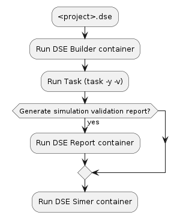
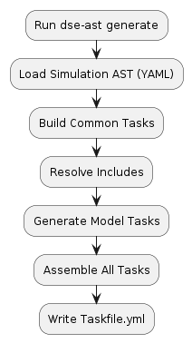
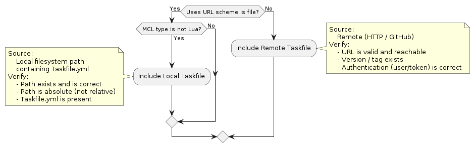
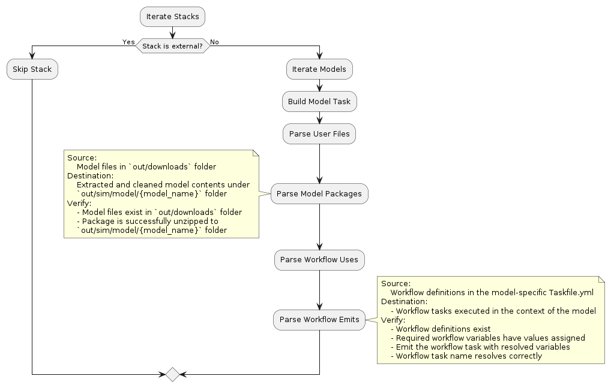
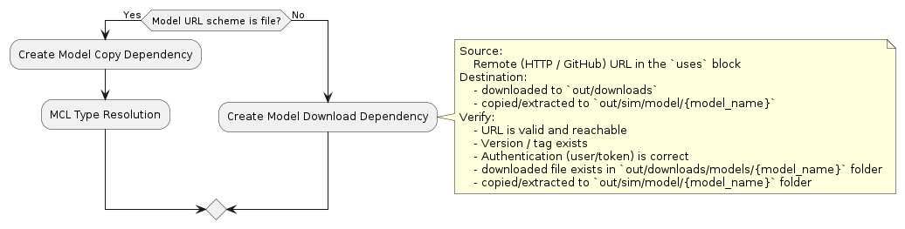
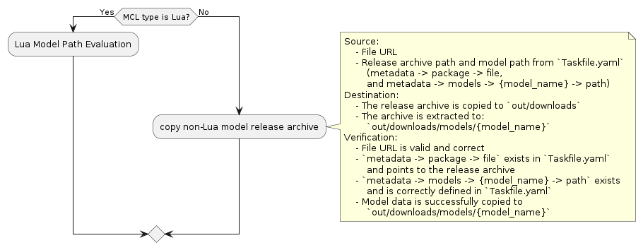
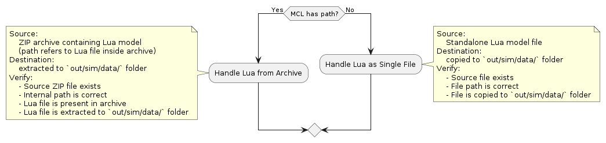
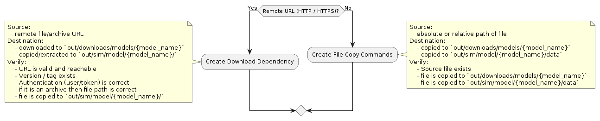
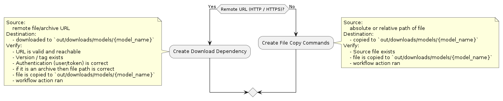

## Synopsis

This document describes the  simulation execution workflow and Taskfile.yml generation used by the Simulation Development Platform (SDP).

## Project folder structure

```text
<project>
├── <project>.dse
├── Makefile
├── <project>.json
├── <project>.yaml
├── simulation.yaml
├── Taskfile.yml
├── .task/
│   └── remote/
│       └── <remote-source>.Taskfile.yml.<hash>.yaml
├── out/
│   ├── cache/
│   ├── downloads/
│   │   ├── <downloaded-files>
│   │   └── models/
│   │       └── <model>/
│   └── sim/
│       ├── data/
│       │   └── simulation.yaml
│       └── model/
│           ├── <model>/
│           │   └── data/
│           └── <model>/
│               ├── data/
│               └── lib/
```

### Source and build files
`<project>.dse` – Defines the simulation configuration, including models, channels, and referenced resources.<br/>
`Makefile` – Contains build commands to generate specifications and prepare the simulation environment.<br/>

### Generated specification files

The following files are generated from `<project>.dse` during the build process:<br/>

`<project>.json` – JSON AST form of the simulation specification<br/>
`<project>.yaml` – YAML AST form of the generated JSON AST<br/>
`simulation.yaml` – Resolved simulation configuration<br/>
`Taskfile.yml` – Task definitions used for build and execution<br/>

### Output directory (out/)

All contents under `out/` are generated and used at build or runtime.<br/>
`out/cache/` – Internal cache for resolution and build steps.<br/>
`out/downloads/` – Downloaded artifacts and external resources (e.g., model archives, binaries).<br/>
`out/sim/` – Simulation runtime directory.<br/>

### Simulation runtime layout

`out/sim/data/` – Contains the generated `simulation.yaml` used at runtime.<br/>
`out/sim/model/` – Runtime directories for each model defined in `<project>.dse`.<br/>
`<model>/data/` – Model-specific data<br/>
`<model>/lib/` – Model libraries or binaries (if required)

### Task runtime metadata

`.task/remote/` – Cached Taskfiles fetched from remote sources during execution.<br/>

## Simulation Flow

<!--

```
@startuml simulation_flow_diagram
:<project>.dse;
:Run DSE Builder container;
:Run Task (task -y -v);
if (Generate simulation validation report?) then (yes)
  :Run DSE Report container;
endif
:Run DSE Simer container;
@enduml
```

-->



### DSE Builder container
Image: `ghcr.io/boschglobal/dse-builder:latest`

The DSE Builder container is responsible for transforming a `.dse` simulation definition into `simulation.yaml` and `Taskfile.yml`.

It runs the following command-line tools in sequence:

```bash
dse-parse2ast <project>.dse <project>.json
dse-ast convert -input <project>.json -output <project>.yaml
dse-ast resolve -input <project>.yaml
dse-ast generate -input <project>.yaml -output .
```

### DSE Report container
Image: `ghcr.io/boschglobal/dse-report:latest`

The DSE Report container is a containerized simulation validation and reporting tool for Simer-based simulations.

It runs the following command-line tool:

```bash
dse-report path/to/simulation
```

### DSE Simer container
Image: `ghcr.io/boschglobal/dse-simer:latest`

The DSE Simer container provides a containerized runtime environment for executing simulations defined using the DSE framework. It runs simulations based on the resolved simulation.yaml configuration.

It runs the following command-line tool:
```bash
simer path/to/simulation -stepsize 0.0005 -endtime 0.04
```

## Taskfile Generation

This section provides a high-level view of the end-to-end Taskfile generation flow.  
Starting from the simulation AST, the Builder constructs common tasks, resolves includes, generates model-specific tasks, and assembles the final `Taskfile.yml`.

<!--
  
```
@startuml highlevel_flow_diagram
:Run dse-ast generate;
:Load Simulation AST (YAML);
:Build Common Tasks;
:Resolve Includes;
:Generate Model Tasks;
:Assemble All Tasks;
:Write Taskfile.yml;
@enduml
```
-->




### Resolve Includes

This stage resolves all Taskfile includes referenced by the simulation configuration.  
Includes may originate from the local filesystem or from remote repositories, depending on the `uses` definition and model characteristics.

<!--
  
```
@startuml build_includes
if (Uses URL scheme is file?) then (Yes)
    if (MCL type is not Lua?) then (Yes)
        :Include Local Taskfile;
            note left
                Source:
                    Local filesystem path
                    containing Taskfile.yml
                Verify:
                    - Path exists and is correct
                    - Path is absolute (not relative)
                    - Taskfile.yml is present
            end note
    else (No)
    endif
else (No)
    :Include Remote Taskfile;
        note right
            Source:
                Remote (HTTP / GitHub)
            Verify:
                - URL is valid and reachable
                - Version / tag exists
                - Authentication (user/token) is correct
        end note
endif
@enduml
```
-->




### Generate Model Tasks

This stage iterates through all stacks and models defined in the simulation.  
For each eligible model, the Builder generates model-specific tasks, prepares runtime artifacts, and resolves associated workflows.

<!--
  
```
@startuml build_model_tasks
:Iterate Stacks;
if (Stack is external?) then (Yes)
    :Skip Stack;
else (No)
    :Iterate Models;
    :Build Model Task;
    :Parse User Files;
    :Parse Model Packages;
        note left
            Source:
                Model files in `out/downloads` folder
            Destination:
                Extracted and cleaned model contents under
                `out/sim/model/{model_name}` folder
            Verify:
                - Model files exist in `out/downloads` folder
                - Package is successfully unzipped to
                `out/sim/model/{model_name}` folder
        end note
    :Parse Workflow Uses;
    :Parse Workflow Emits;
        note right
            Source:
                Workflow definitions in the model-specific Taskfile.yml
            Destination:
                - Workflow tasks executed in the context of the model
            Verify:
                - Workflow definitions exist
                - Required workflow variables have values assigned
                - Emit the workflow task with resolved variables
                - Workflow task name resolves correctly
        end note
endif
@enduml
```
-->




### Build Model Task

This step determines how an individual model is sourced and prepared.  
Models may be copied from local paths or downloaded from remote locations, depending on the model definition.

<!--
  
```
@startuml model_task
if (Model URL scheme is file?) then (Yes)
    :Create Model Copy Dependency;
    :MCL Type Resolution;
else (No)
    :Create Model Download Dependency;
        note right
            Source:
                Remote (HTTP / GitHub) URL in the `uses` block
            Destination:
                - downloaded to `out/downloads`
                - copied/extracted to `out/sim/model/{model_name}`
            Verify:
                - URL is valid and reachable
                - Version / tag exists
                - Authentication (user/token) is correct
                - downloaded file exists in `out/downloads/models/{model_name}` folder
                - copied/extracted to `out/sim/model/{model_name}` folder
        end note
endif
@enduml
```
-->




### MCL Type Resolution

This stage evaluates the **MCL** type to determine the appropriate handling strategy.

- Lua-based models follow a Lua-specific processing flow
- Non-Lua models are handled as packaged release artifacts defined in `Taskfile.yaml`

<!--
  
```
@startuml mcl_type_resolution
if (MCL type is Lua?) then (Yes)
    :Lua Model Path Evaluation;
else (No)
:copy non-Lua model release archive;
    note right
        Source:
            - File URL
            - Release archive path and model path from `Taskfile.yaml`
                (metadata -> package -> file, 
                and metadata -> models -> {model_name} -> path)
        Destination:
            - The release archive is copied to `out/downloads`
            - The archive is extracted to:
                `out/downloads/models/{model_name}`
        Verification:
            - File URL is valid and correct
            - `metadata -> package -> file` exists in `Taskfile.yaml`
                and points to the release archive
            - `metadata -> models -> {model_name} -> path` exists
                and is correctly defined in `Taskfile.yaml`
            - Model data is successfully copied to
                `out/downloads/models/{model_name}`
    end note
endif
@enduml
```
-->




### Lua Model Path Evaluation

For Lua-based models, this step determines whether the model is packaged within an archive or provided as a standalone file, and processes it accordingly.

<!--
  
```
@startuml lua_model_path_evaluation
if (MCL has path?) then (Yes)
    :Handle Lua from Archive;
        note left
            Source:
                ZIP archive containing Lua model
                (path refers to Lua file inside archive)
            Destination:
                extracted to `out/sim/data/` folder
            Verify:
                - Source ZIP file exists
                - Internal path is correct
                - Lua file is present in archive
                - Lua file is extracted to `out/sim/data/` folder
        end note
else (No)
    :Handle Lua as Single File;
        note right
            Source:
                Standalone Lua model file
            Destination:
                copied to `out/sim/data/` folder
            Verify:
                - Source file exists
                - File path is correct
                - File is copied to `out/sim/data/` folder
        end note
endif
@enduml
```
-->




### Parse User Files

This stage processes user-provided files associated with a model.  
Files may be sourced locally or downloaded remotely, and are copied or extracted into the model’s runtime directory.

<!--
  
```
@startuml parse_user_files
if (Remote URL (HTTP / HTTPS)?) then (Yes)
    :Create Download Dependency;
        note left
            Source:
                remote file/archive URL
            Destination:
                - downloaded to `out/downloads/models/{model_name}`
                - copied/extracted to `out/sim/model/{model_name}/`
            Verify:
                - URL is valid and reachable
                - Version / tag exists
                - Authentication (user/token) is correct
                - if it is an archive then file path is correct
                - file is copied to `out/sim/model/{model_name}/`
        end note
else (No)
    :Create File Copy Commands;
        note right
            Source:
                absolute or relative path of file
            Destination:
                - copied to `out/downloads/models/{model_name}`
                - copied to `out/sim/model/{model_name}/data`
            Verify:
                - Source file exists
                - file is copied to `out/downloads/models/{model_name}`
                - file is copied to `out/sim/model/{model_name}/data`
        end note
endif
@enduml
```
-->




### Parse Workflow Uses

This step resolves workflow dependencies referenced by a model.  
Workflow artifacts are fetched or copied as required, and the associated workflow actions are executed in the model context.

<!--
  
```
@startuml parse_workflow_uses
if (Remote URL (HTTP / HTTPS)?) then (Yes)
    :Create Download Dependency;
        note left
            Source:
                remote file/archive URL
            Destination:
                - downloaded to `out/downloads/models/{model_name}`
            Verify:
                - URL is valid and reachable
                - Version / tag exists
                - Authentication (user/token) is correct
                - if it is an archive then file path is correct
                - file is copied to `out/downloads/models/{model_name}`
                - workflow action ran
        end note
else (No)
    :Create File Copy Commands;
        note right
            Source:
                absolute or relative path of file
            Destination:
                - copied to `out/downloads/models/{model_name}`
            Verify:
                - Source file exists
                - file is copied to `out/downloads/models/{model_name}`
                - workflow action ran
        end note
endif
@enduml
```
-->


