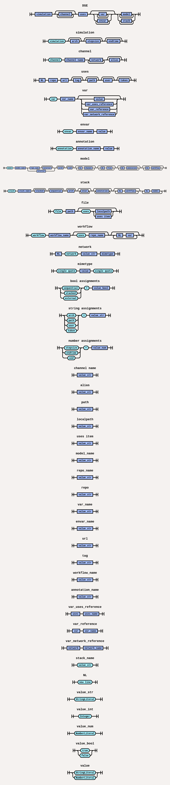

## Synopsis
DSL Tools.

```bash
$ dse-parse2ast [args]
```


## Commands
### dse-parse2ast

Convert a DSE file into an intermediate JSON representation.

```bash
$ dse-parse2ast <dse_file_path> <json_output_file_path>
```

## Keywords

### simulation
Defines the simulation setup including architecture, stepsize, and endtime.

<pre>
<b>simulation</b> <b>arch</b>=linux-amd64 <b>stepsize</b>=0.0005 <b>endtime</b>=0.005
</pre>

### arch
Specifies the architecture in simulation or stack or model level (default : linux-amd64 ).
<pre>
<b>simulation</b> <b>arch</b>=linux-amd64
</pre>

### stepsize
Time increment for each simulation step (default : 0.0005).
<pre>
<b>simulation</b> <b>stepsize</b>=0.0005
</pre>

### endtime
Total simulation duration step (default : 0.005).
<pre>
<b>simulation</b> <b>endtime</b>=0.005
</pre>

### channel  
Declares a communication channel.
<pre>
<b>channel</b> physical
</pre>

### network  
The network keyword is used in two related but distinct contexts:
#### Defining a network interface
At the channel level, network declares a named network interface and its MIME type.
<pre>
<b>network</b> CAN 'application/x-automotive-bus;interface=stream;type=frame;bus=can;schema=fbs;bus_id=1'
</pre>
 - CAN is the network or signal name
 - The string value is the network MIME type

#### Referencing a network from model variables
At the model level, the network keyword can also be used as a reference type inside var declarations.
This allows to apply templating to the MIME type using variables.
The <b>mimetype</b> or <b>signal</b> keyword after the network/signal name in network reference determines which property of the network is assigned to the variable
<pre>
<b>simulation</b>
<b>channel</b> binary_channel
<b>network</b> can 'application/x-automotive-bus;interface=stream;type=frame;bus=can;schema=fbs;bus_id={{BUS_ID}};interface_id={{INTERFACE_ID}}'
<b>model</b> network_can Network_CAN <b>uid</b>=42
<b>channel</b> binary_channel binary
<b>var</b> BUS_ID 1
<b>var</b> INTERFACE_ID 3
<b>var</b> MIMETYPE <b>network</b> can <b>mimetype</b>
<b>var</b> SIGNAL   <b>network</b> can <b>signal</b>
</pre>

### uses  
Imports external dependencies such as modules, FMUs, files or Lua models.
The `uses` keyword supports both **remote** and **local** references.

#### Remote references
Dependencies can be fetched from external sources such as GitHub or artifact repositories.  
Authentication (e.g., using a personal access token) may be required.
<pre>
<b>uses</b>
dse.fmi https://github.com/boschglobal/dse.fmi v1.1.34
example https://github.boschdevcloud.com/fsil/fsil.runnable/releases/download/v1.1.2/example.zip <b>token</b>={{.GHE_PAT}}
</pre>

#### Local references
Dependencies can also be referenced directly from the local filesystem.
Both absolute and relative paths are supported.
<pre>
<b>uses</b>
example1 /home/users/example.zip
example2 example.zip
</pre>

#### Lua model references
Lua-based models can be referenced using the `file://` URI scheme (absolute path).
A reference may point directly to a Lua file or to an archive (`.zip`) containing one or more Lua models.

<pre>
<b>uses</b>
Csv file:///{{.PWD}}/csv.lua
Linear file:///{{.PWD}}/models.zip path=linear/linear.lua
...
<b>model</b> csv Csv
...
<b>model</b> linear Linear
...
</pre>

### var  
Declares variables, which may refer to other resources or contain static values.
<pre>
<b>model</b> runnable fsil.runnable <b>uid</b>=5
<b>channel</b> signal signal_channel
<b>channel</b> network network_channel

<b>workflow</b> unpack-runnable-target
    <b>var</b> ROOT_DIR {{.OUTDIR}}
    <b>var</b> ZIP <b>uses</b> example
    <b>var</b> DIR {{.SIMDIR}}/{{.PATH}}
</pre>

### model  
Defines a component in the simulation, such as an FMU or a gateway.
<pre>
<b>model</b> runnable fsil.runnable
<b>channel</b> signal signal_channel
<b>channel</b> network network_channel
</pre>

### uid  
Assigns a unique ID to a model.
<pre>
<b>model</b> runnable fsil.runnable <b>uid</b>=5
<b>channel</b> signal signal_channel
<b>channel</b> network network_channel
</pre>

### envar  
Declares an environment variable used at model or stack scope.
<pre>
<b>model</b> runnable fsil.runnable <b>uid</b>=5
<b>channel</b> signal signal_channel
<b>channel</b> network network_channel
<b>envar</b> SIMBUS_LOGLEVEL 3
</pre>

### workflow  
Defines a processing or generation step applied to a model or stack.
<pre>
<b>model</b> runnable fsil.runnable <b>uid</b>=5
<b>channel</b> signal signal_channel
<b>channel</b> network network_channel

<b>workflow</b> unpack-runnable-target
    <b>var</b> ROOT_DIR {{.OUTDIR}}
    <b>var</b> ZIP <b>uses</b> example
    <b>var</b> DIR {{.SIMDIR}}/{{.PATH}}
</pre>

### stack  
Declares a group of models composed together for simulation.
<pre>
<b>stack</b> fmu-stack

<b>model</b> FMU_S1 dse.fmi.mcl
<b>channel</b> physical scalar_vector
<b>workflow</b> generate-fmimcl
<b>var</b> FMU_DIR <b>uses</b> fmu_s1
<b>var</b> MCL_PATH some/path
<b>var</b> OUT_DIR {{.model.name}}

<b>model</b> FMU_S2 dse.fmi.mcl
<b>channel</b> physical scalar_vector
<b>workflow</b> generate-fmimcl
<b>var</b> FMU_DIR <b>uses</b> fmu_s2
<b>var</b> MCL_PATH some/path
<b>var</b> OUT_DIR {{.model.name}}
</pre>

### stacked  
A boolean flag that indicates if the models in a stack should be layered.
<pre>
<b>stack</b> fmu-stack <b>stacked</b>=true <b>arch</b>=linux-x86

<b>model</b> FMU_S1 dse.fmi.mcl
<b>channel</b> physical scalar_vector
<b>workflow</b> generate-fmimcl
<b>var</b> FMU_DIR <b>uses</b> fmu_s1
<b>var</b> MCL_PATH some/path
<b>var</b> OUT_DIR {{.model.name}}

<b>model</b> FMU_S2 dse.fmi.mcl
<b>channel</b> physical scalar_vector
<b>workflow</b> generate-fmimcl
<b>var</b> FMU_DIR <b>uses</b> fmu_s2
<b>var</b> MCL_PATH some/path
<b>var</b> OUT_DIR {{.model.name}}
</pre>

### sequential  
A boolean flag for stacks that ensures models are executed one after another, in a defined order.
<pre>
<b>stack</b> fmu-stack <b>stacked</b>=true <b>sequential</b>=true <b>arch</b>=linux-x86

<b>model</b> FMU_S1 dse.fmi.mcl
<b>channel</b> physical scalar_vector
<b>workflow</b> generate-fmimcl
<b>var</b> FMU_DIR <b>uses</b> fmu_s1
<b>var</b> MCL_PATH some/path
<b>var</b> OUT_DIR {{.model.name}}

<b>model</b> FMU_S2 dse.fmi.mcl
<b>channel</b> physical scalar_vector
<b>workflow</b> generate-fmimcl
<b>var</b> FMU_DIR <b>uses</b> fmu_s2
<b>var</b> MCL_PATH some/path
<b>var</b> OUT_DIR {{.model.name}}
</pre>

### file  
Maps or includes external input/configuration files in the simulation.
<pre>
<b>model</b> FMU dse.fmi.mcl <b>uid</b>=42
<b>channel</b> physical scalar_vector
<b>file</b> input.csv <b>uses</b> input_file
<b>file</b> data/signalgroup.yaml sample/data/signalgroup.yaml
<b>workflow</b> generate-fmimcl
  <b>var</b> FMU_DIR <b>uses</b> fmu_2
  <b>var</b> MCL_PATH some/path
  <b>var</b> OUT_DIR {{.model.name}}
</pre>

### Example DSL File

<details>
<summary>openloop.dse</summary>

<pre>
<b>simulation</b> <b>arch</b>=linux-amd64
<b>channel</b> physical

<b>uses</b>
dse.modelc https://github.com/boschglobal/dse.modelc v2.1.23
dse.fmi https://github.com/boschglobal/dse.fmi v1.1.23
linear_fmu https://github.com/boschglobal/dse.fmi/releases/download/v1.1.23/Fmi-1.1.23-linux-amd64.zip <b>path</b>=examples/fmu/linear/fmi2/linear.fmu

<b>model</b> input dse.modelc.csv
<b>channel</b> physical signal_channel
<b>envar</b> CSV_FILE model/input/data/input.csv
<b>file</b> input.csv input/openloop.csv
<b>file</b> signalgroup.yaml input/signalgroup.yaml

<b>model</b> linear dse.fmi.mcl
<b>channel</b> physical signal_channel
<b>envar</b> MEASUREMENT_FILE /sim/measurement.mf4
<b>workflow</b> generate-fmimcl
<b>var</b> FMU_DIR <b>uses</b> linear_fmu
<b>var</b> OUT_DIR {{.PATH}}/data
<b>var</b> MCL_PATH {{.PATH}}/lib/libfmimcl.so
</pre>
</details>

## Syntax Diagram


