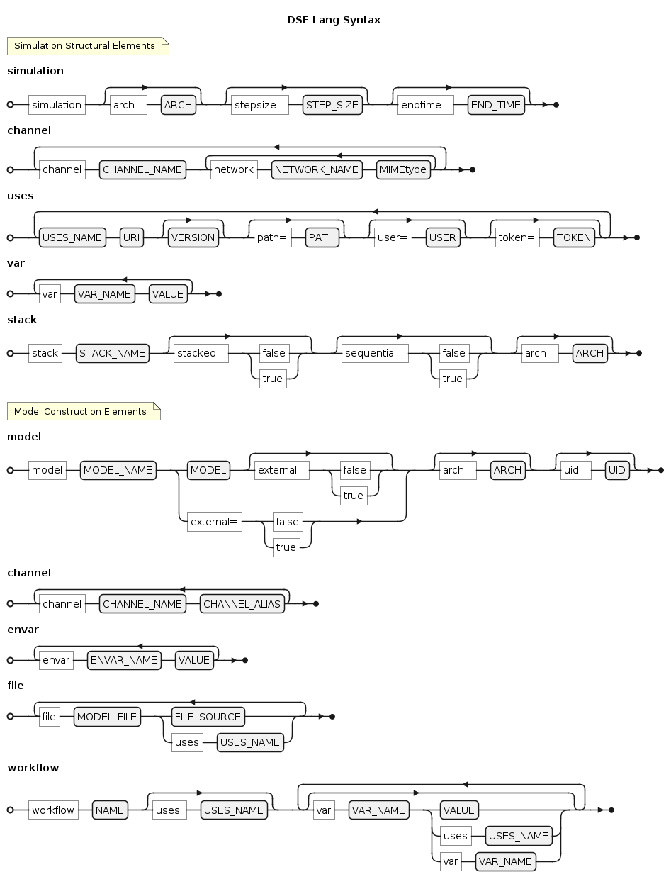

## Synopsis

Containerised simulation builder with DSL (DSE Lang).


#### Describe a Simulation

```hs
simulation arch=linux-amd64
channel network

uses
dse.fmi https://github.com/boschglobal/dse.fmi v1.1.32

model fmu_CAN dse.fmi.network_model
    channel network network_channel

workflow generate-model
    var NETWORK_SIGNAL can_bus
    var MIME_TYPE "application/x-automotive-bus;interface=stream;type=frame;bus=can;schema=fbs;bus_id=1;node_id=2;interface_id=3"
    var MEASUREMENT measurement.txt
    var OUT_DIR {{.PATH}}/data

workflow generate-fmimodelc
    var FMU_NAME example
    var SIGNAL_GROUPS network
```

#### Use the Builder Tool

```bash
# Build a simulation.
$ cd examples/runnable
$ builder runnable.dse
$ task -y
```

#### Run the Simulation

```bash
# Run a simulation.
$ simer out/sim -stepsize 0.0005 -endtime 0.10
```


## DSE Lang

Simulations using the Simulation Development Platform (SDP) are written in a
custom DSL called **DSE Lang**. 
This DSL is used to describe the construction of a _simulation_ and its 
constituent _channels_, _models_ and _workflows_.

<div hidden>

```
@startuml

@startebnf dse-lang-syntax

title DSE Lang Syntax

(* Simulation Structural Elements *)

simulation = "simulation", [ "arch=", ARCH ], [ "stepsize=", STEP_SIZE ], [ "endtime=", END_TIME ];
channel = { "channel", CHANNEL_NAME, { "network", NETWORK_NAME, MIMEtype}- }-;
uses = {USES_NAME, URI, [ VERSION ], [ "path=", PATH ], [ "user=", USER ], [ "token=", TOKEN ]}-;
var = { "var", VAR_NAME, VALUE}-;
stack = "stack", STACK_NAME, [ "stacked=", ( "false" | "true" ) ], [ "sequential=", ( "false" | "true" ) ], [ "arch=", ARCH ];

(* Model Construction Elements *)

model =
    "model", MODEL_NAME,
    (
        MODEL, [ "external=", ( "false" | "true" ) ]
      | "external=", ( "false" | "true" )
    ),
    [ "arch=", ARCH ],
    [ "uid=", UID ];
channel = { "channel", CHANNEL_NAME, CHANNEL_ALIAS }-;
envar = { "envar", ENVAR_NAME, VALUE }-;
file = { "file", MODEL_FILE, (FILE_SOURCE | "uses", USES_NAME) }-;


workflow = 
    "workflow", NAME, [ "uses ", USES_NAME ],
    {[ "var", VAR_NAME, (VALUE | "uses", USES_NAME | "var", VAR_NAME)]}-;
@endebnf

@enduml
```

</div>




### Channel (Model)

<pre>
<b>channel</b> <var>CHANNEL_NAME</var> <var>CHANNEL_ALIAS</var>
</pre>

* <code><var>CHANNEL_NAME</var></code>: the name of a simulation channel.
* <code><var>CHANNEL_ALIAS</var></code>: the alias used by the model for this channel.


### Channel (Simulation)

<pre>
<b>channel</b> <var>CHANNEL_NAME</var>
[network <var>NETWORK_NAME</var> <var>MIME_TYPE</var>] ...
</pre>

* <code><var>CHANNEL_NAME</var></code>: the name of a simulation/model channel.
* <code><var>NETWORK_NAME</var></code>: the name of the network.
* <code><var>MIME_TYPE</var></code>: the network’s protocol, format, and attributes.


### Envar

<pre>
<b>envar</b> <var>ENVAR_NAME</var> <var>VAR_VALUE</var>
</pre>

* <code><var>ENVAR_NAME</var></code>: the _name_ of a environment variable.
* <code><var>VAR_VALUE</var></code>: the variable _value_.


### File

<pre>
<b>file</b> <var>MODEL_FILE</var> [FILE_SOURCE]
<b>file</b> <var>MODEL_FILE</var> [use USES_NAME]
</pre>

* <code><var>MODEL_FILE</var></code>: the _name_ by which the model refers to the file.
* <code><var>FILE_SOURCE</var></code>: the actual _path_ of the file.
* <code><var>USES_NAME</var></code>: the name of a dependency that this file entry imports.


### Model

<pre>
<b>model</b> <var>MODEL_INST_NAME</var> <var>MODEL_NAME</var> [external=<var>EXTERNAL</var>] [arch=<var>ARCH</var>] [uid=<var>UID</var>]
[<b>channel</b> <var>CHANNEL_NAME</var> <var>CHANNEL_ALIAS</var>] ...
</pre>

* <code><var>MODEL_INST_NAME</var></code>: the name of the _model_ (used within the simulation).
* <code><var>MODEL_NAME</var></code>: the name of the _model_ as referenced by a _uses_ item.
* <code><var>EXTERNAL</var></code>: the boolean flag indicating that the model is external, either a complete external model or one linked with workflows. When the model is fully external, it belongs to the external stack.
* <code><var>ARCH</var></code>: the architecture of this _model_.
* <code><var>UID</var></code>: the unique id of the model.
* <code><var>CHANNEL_NAME</var></code>: the name of a simulation channel to be mapped to this _model_.
* <code><var>CHANNEL_ALIAS</var></code>: the _model_ alias for the channel being mapped.


### Simulation

<pre>
<b>simulation</b> [arch=<var>ARCH</var>] [stepsize=<var>STEP_SIZE</var>] [endtime=<var>END_TIME</var>]
[channel <var>CHANNEL_NAME</var>] ...
</pre>

* <code><var>ARCH</var></code>: the architecture of the overall simulation. Select from supported platforms, including:
  * <code>linux-amd64</code>
  * <code>linux-x86</code>
  * <code>linux-i386</code>
  * <code>windows-x64</code>
  * <code>windows-x86</code>
* <code><var>STEP_SIZE</var></code>: the time increment for each simulation step (default : 0.0005).
* <code><var>END_TIME</var></code>: the total simulation duration (default : 0.005).


### Stack

<pre>
<b>stack</b> <var>STACK_NAME</var> [stacked=<var>STACKED</var>] [sequential=<var>SEQUENTIAL</var>] [arch=<var>ARCH</var>]
</pre>

* <code><var>STACK_NAME</var></code>: the name of the _stack_.
* <code><var>STACKED</var></code>: the boolean flag that indicates if the models in a stack should be layered.
* <code><var>SEQUENTIAL</var></code>: the boolean flag for stacks that ensures models are executed one after another, in a defined order.
* <code><var>ARCH</var></code>: the architecture of this _stack_ and the models it contains.


### Uses

<pre>
<b>uses</b>
[<var>USES_NAME</var> <var>URI</var> [<var>VERSION</var>] [path=<var>PATH</var>] [user=<var>USER</var>] [token=<var>TOKEN</var>]] ...
</pre>

* <code><var>USES_NAME</var></code>: the name of the _uses_ item.
* <code><var>URI</var></code>: a URI for the _uses_ item. May be a URL or file.
* <code><var>VERSION</var></code>: the version of the _uses_ item.
* <code><var>PATH</var></code>: a sub-path of the _uses_ item (incase the item should be extracted from a ZIP archive).
* <code><var>USER</var></code>: authentication user needed for retrieving the _uses_item.
* <code><var>TOKEN</var></code>: authentication token (or password) needed for retrieving the _uses_item.


### Var

<pre>
<b>var</b> <var>VAR_NAME</var> <var>VAR_VALUE</var>
</pre>

* <code><var>VAR_NAME</var></code>: the _name_ of a variable.
* <code><var>VAR_VALUE</var></code>: the variable _value_.


### Workflow

<pre>
<b>Workflow</b> <var>WORKFLOW_NAME</var> [uses USES_NAME]
[<b>var</b> <var>VAR_NAME</var> <var>VAR_VALUE</var>] ...
[<b>var</b> <var>VAR_NAME</var> <b>uses</b> <var>USES_NAME</var>] ...
</pre>

* <code><var>WORKFLOW_NAME</var></code>: the name of the _workflow_.
* <code><var>USES_NAME</var></code> (workflow level): the name of a dependency that this workflow imports.  
* <code><var>VAR_NAME</var></code>: the _name_ of a variable used by this workflow.
* <code><var>VAR_VALUE</var></code>: the variable _value_.
* <code><var>USES_NAME</var></code> (variable level): sets the variable value to the path of this _uses_ item.


## Special Variables

DSE Lang uses a templating mechanism to introduce special variables to a DSE
Script (in the form: `{{ .SPECIAL_VAR }}`). Those variables are used to influence how a simulation is constructed.
Additionally, the templating mechanism can be used to introduce environment
variables to a DSE Script (useful for authentication).


ENV_VAR
: Expands to the named <var>ENV_VAR</var>.

MODEL
: When used within the context of a _model_ expands to the models name (i.e. <var>MODEL_INST_NAME</var>).

OUTDIR
: The output directory of the SDP toolchains (typically <code>out</code>). Contains the simulation folder.

PATH
: When used within the context of a _model_ expands to the models path within the simulation filesystem (set to <var>SIMDIR</var>/<var>MODEL_INST_NAME</var>).

SIMDIR
: The simulation folder (typically <code>sim</code>).


## Builder Tool

> Info: The Builder Tool is already setup and configured in both GitHub Codespaces and
Dev Containers environments.


### Setup

The SDP Builder is a containerized tool which can be configured and used in a
Linux environment. The following container images are available.

```bash
# Latest Builder Container:
$ docker pull ghcr.io/boschglobal/dse-builder:latest

# Specific versions of the Builder Container
$ docker pull ghcr.io/boschglobal/dse-builder:1.0.4
$ docker pull ghcr.io/boschglobal/dse-builder:1.0
```

#### Shell Function

> Info: The following shell function passes credentials to the Build Container
> which are used to fetch artifacts and repository metadata. Adjust as necessary
> for your environment (the `-e` parameters of the `docker` command).

```bash
# Define a shell function (or add to .profile file).
$ export BUILDER_IMAGE=ghcr.io/boschglobal/dse-builder:latest
$ builder() { ( if test -f "$1"; then cd $(dirname "$1"); fi && docker run -it --user $(id -u):$(id -g) --rm -e AR_USER -e AR_TOKEN -e GHE_USER -e GHE_TOKEN -e GHE_PAT -v $(pwd):/workdir $BUILDER_IMAGE "$@"; ) }

# Build the simulation.
$ cd examples/runnable
$ builder runnable.dse

# And then use Task to complete the simulation (according to the build plan).
export TASK_X_REMOTE_TASKFILES=1
$ task -y -v
ls -R out/sim
```


### Authentication

Any `uses` items in your DSE Script which require authentication credentials
need to be defined in your environment and passed to the builder container. For
example the following DSE Script uses a private GitHub repository and
Artifactory instance:

```hs
simulation arch=linux-amd64
channel signal

uses
fsil.runnable https://{{.GHE_TOKEN}}@github.boschdevcloud.com/fsil/fsil.runnable v1.1.2 user={{.AR_USER}} token={{.AR_TOKEN}}
```

and needs the following authentication setup:

```bash
# Define authentication tokens.
export AR_USER=foo
export AR_TOKEN=foo_token
export GHE_TOKEN=goo_token

# Specify the shell function.
$ builder() { ( if test -f "$1"; then cd $(dirname "$1"); fi && docker run -it --user $(id -u):$(id -g) --rm -e AR_USER -e AR_TOKEN -e GHE_TOKEN -v $(pwd):/workdir $BUILDER_IMAGE "$@"; ) }
```
