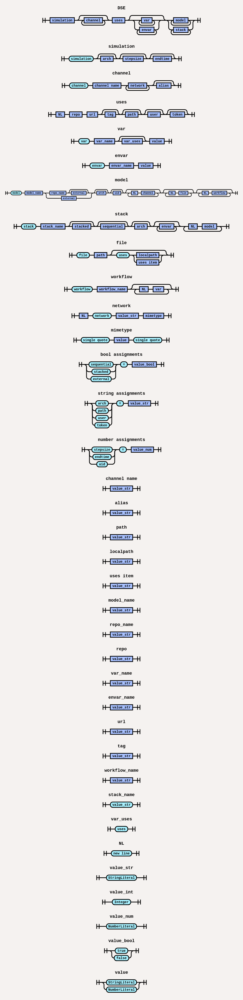

## Synopsis
DSL Tools.

```bash
$ dse-parse2ast [args]
```


## Commands
### dse-parse2ast

Convert a DSE file into an intermediate JSON representation.

```bash
$ dse-parse2ast <dse_file_path> <json_output_file_path>
```

## Syntax Diagram

