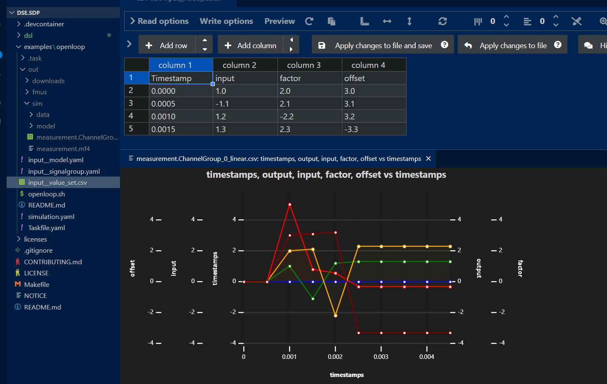

# Open Loop Simulation Example

## Introduction

Use a simple CSV file, via an input model, to operate an Open Loop simulation which represents an Linear Equation.




## Usage

Make the most of this example by installing the following VS Code extensions:

1. Install the "Edit csv" extension (Ctrl-Shift-X, then search "Edit csv").

2. Install the "VS Plotter" extension (Ctrl-Shift-X, then search "VS Plotter").

Start a Codespace, then type the following commands in the terminal window.

__Cloudspace Terminal__
```bash
$ cd examples/openloop

# Install python package ASAMMDF.
$ pip install asammdf[gui]

# Build and run the example simulation.
$ make build
$ make simer

# Check the simulation.
$ make report

# Create measurement file.
$ ./post_run.sh
...
Simulation complete.
Measurement file : out/sim/measurement.mf4
Measurement file : out/sim/measurement.ChannelGroup_0_linear.csv (converted)
# View the measurement, using VS Code extension "VS Plotter" to open CSV file.

# (Optional) View the measurement using ASAMMDF.
$ asammdf --measurements out/sim/measurement.mf4


### Simulation Layout (generated by Taskfile)

```text
L- data
  L- simulation.yaml    Simulation definition, contains stacks.
L- model/input
  L- data
    L- input.csv        Scenario definition in CSV format.
    L- model.yaml       Model definition.
    L- signalgroup.yaml Generated SignalGroup (based on input.csv).
  L- lib
    L- libcsv.so        Model implementation (shared library).
L- model/linear
  L- data
    L- model.yaml       Generated model definition.
    L- signalgroup.yaml Generated SignalGroup.
  L- fmu
    L- modelDescription.xml
    L- resources
    L- binaries/linux64
      L- libfmu2linear.so
  L- lib
    L- libfmimcl.so
```