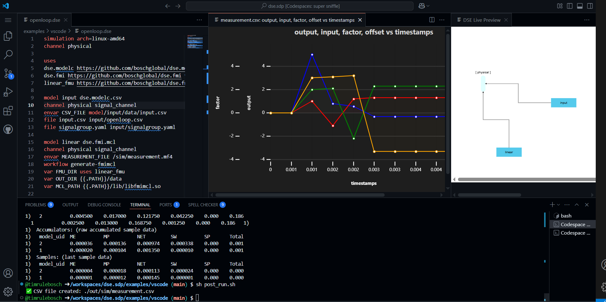

# VS Code Integration Example

## Introduction

This example demonstrates the VS Code Integration including: DSE Support, Preview, Commands and Measurement Plotting.




## Usage

### Using VS Code Integration with a Codespace

1. Open a Codespace for the [DSE SDP](https://github.com/boschglobal/dse.sdp) repository. Once connected to the Codespace, the `postCreateCommand` may take some moments to complete (i.e. automatically running `make && make install`).
2. Navigate to the examples/vscode folder.
3. Open the file `openloop.dse` in an editor.
4. Use the preview button (or type `Ctrl + K then V`) to view a visualization of the Simulation.
5. Build the simulation: type `Ctrl + Shift + P` and then select command `DSE:Build`. Output of the build command will appear in the `TERMINAL` window.
6. Run the simulation: type `Ctrl + Shift + P` and then select command `DSE:Run`. Output of the run command will appear in the `TERMINAL` window.
7. Generate a measurement plot:
    1. Type `Ctrl + Shift + P` and then select command `VSPlotter: Create new plot from a workspace file`.
    2. Select `out/sim/measurement.csv`.
    3. For the x-axis column, select `timestamps`.
    4. For the y-axis columns, select the remaining data fields.


### Alternative: Using the Terminal

Open a new Bash terminal in the Codespace, and then run the following commands.

```bash
$ cd examples/vscode

# Build the simulation.
$ make build
$ make report

# Run the simulation.
$ make run

# Cleanup any generated files.
$ make clean
```


## Details

### Simulation Project Layout

```text
(Git committed files)
L- .gitignore          Git ignore file.
L- Makefile            Makefile automation.
L- openloop.dse        Simulation script written in DSE Simulation Language.
L- post_run.sh         Post simulation-run script (processes measurement).
L- README.md           Readme file supporting this example.        
L- extra           
  L- openloop.yaml     Reference ASL for the openloop simulation.
L- input
  L- openloop.csv      Data for the input model.
  L- signalgroup.yaml  Supporting SignalGroup for openloop.csv.

(Generated files)
L- simulation.yaml     Generated simulation (contains stacks).
L- Taskfile.yaml       Generated taskfile (constructs the simulation).
L- out     
  L- cache       	     Cached metadata.
  L- downloads         Downloaded content (models, tools ...).
  L- sim               Generated simulation (with Simer layout).
    L- measurement.mf4 Measurement file (from the linear model).
    L- measurement.csv Measurement file converted to CSV format.
```
